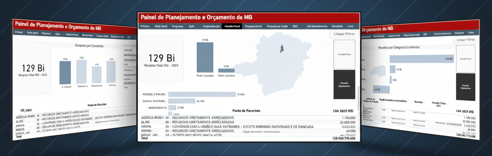

O <strong>Painel de Planejamento e Orçamento de Minas Gerais</strong>, desenvolvido pela Subsecretaria de Planejamento e Orçamento (SPLOR), tem como objetivo apresentar, de forma interativa, prática e dinâmica, as informações orçamentárias do Estado, com destaque para os dados do Plano Plurianual de Ação Governamental (PPAG) e da Lei Orçamentária Anual (LOA).

Este site reúne a documentação do painel e visa registrar, de forma organizada e acessível, como ele foi construído, quais fontes de dados o alimentam, os scripts utilizados no processo e as orientações sobre como atualizar ou evoluir a ferramenta.

Mais do que um manual técnico, esta documentação busca oferecer transparência e compartilhamento de conhecimento, permitindo que servidores e colaboradores compreendam a estrutura do painel e possam replicar, adaptar ou propor melhorias.

[Link do Painel de Planejamento e Orçamento MG](https://app.powerbi.com/view?r=eyJrIjoiMjcyMjkxYzEtODZmYS00OTQyLTg1YzctOWVhNDE3MWFhMjdjIiwidCI6ImU1ZDNhZTdjLTliMzgtNDhkZS1hMDg3LWY2NzM0YTI4NzU3NCJ9)

### Estrutura do site

* **Sobre o painel** – Explica em que consiste o painel, quais são suas principais informações e orienta sobre como navegar pela ferramenta.  

* **Construção do painel** – Detalha a arquitetura do projeto, as fontes de dados utilizadas, os processos de transformação e modelagem, além dos scripts empregados na elaboração dos visuais do relatório.  

* **Publicação e atualização** – Orienta sobre como publicar o relatório no site da SEPLAG e realizar a atualização dos dados.  

* **Glossário** – Reúne os principais conceitos utilizados ao longo da documentação. 

* **FAQ** – Apresenta respostas às dúvidas mais frequentes relacionadas à documentação do painel.  

