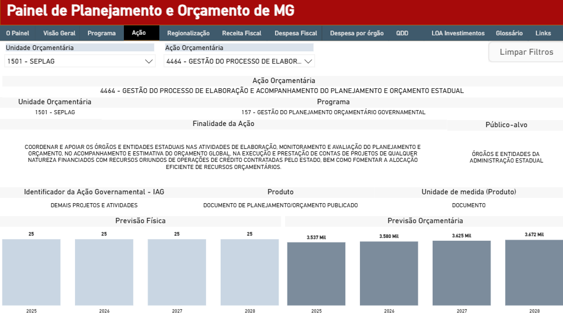
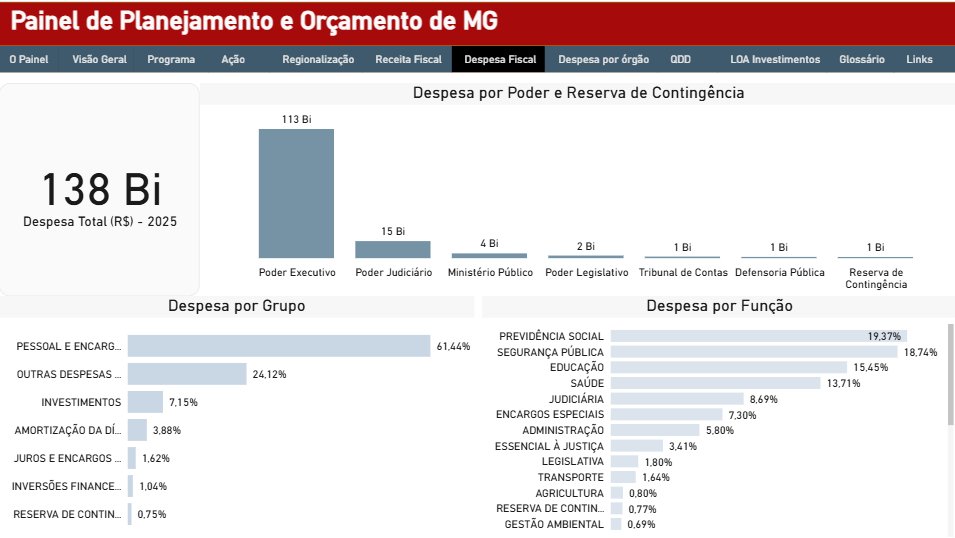

O <strong>Painel de Planejamento e Orçamento de Minas Gerais</strong>, está estruturado em 12 páginas:

 **O Painel** 
 > Apresenta uma breve introdução do escopo do dashboard e do que consiste os instrumentos de planejamento e orçamento do Estado de Minas Gerais. 

 **Visão Geral** 
 > Apresenta informações sobre a previsão total de recursos do orçamento vigente tanto para o Orçamento Fiscal quanto para ao Orçamento de Investimentos, a quantidade de programas e ações, explicitando quantos deles sãos estratégicos. Além disso, detalha o percentual dos valores previstos por área temática e por setor de governo. 

 **Programa** 
 > Detalha os atributos qualitativos e orçamentários dos programas do PPAG, tais como: Unidade Orçamentária, Área Temática, Programa, Objetivo, Objetivo de Desenvolvimento Sustentável (ODS) e Indicadores.  

 **Ação** 
 > Detalha os atributos qualitativos e orçamentários dos programas do PPAG, tais como: Unidade Orçamentária, Programa, Finalidade da Ação, Público-alvo, IAG, Produto e a previsão da meta física e orçamentária.

 **Regionalização** 
 > Explicita por meio de um mapa, a alocação de recursos e as entregas por municipios. Detalha a previsão física e orçamentária, por ação, o produto, a região geográfica e o múnicípio.

 **Receita Fiscal** 
> Apresenta o total da Receita Estimada para o exercício, com segregações por categoria econômica e por fonte de recursos. 

 **Despesa Fiscal** 
 > Explicita o total da Despesa Fixada para o ano, agrupando por Poder, Função e Grupo de Despesa.

 **Despesa por órgão** 
 > Detalha o total das despesas de cada um dos órgãos do Orçamento Fiscal, por Grupo de Despesa, Fonte de Recursos e Ação Orçamentária. 

 **QDD** 
 > Tabela a despesa total fixada para o ano, segregada nas principais variáveis orçamentárias: unidade orçamentária, programa, ação, grupo de despesa, iag, fonte de recursos, ipu e modalidade de aplicação.

 **LOA Investimentos** 
 > Apresenta as receitas previstas e as despesas estimadas para os órgãos e entidades que compõem o Orçamento de Investimentos. 

 **Glossário** 
 > Apresenta a definição técnica e a definição na linguagem simples dos principais conceitos de planejamento e orçamento utilizados no dashboard. 

 **Links** 
 > Explicita os principais links de acesso a páginas que contém informações relevantes sobre os instrumentos de planejamento e orçamento, e também as legislações e normativos afetos à temática. 

